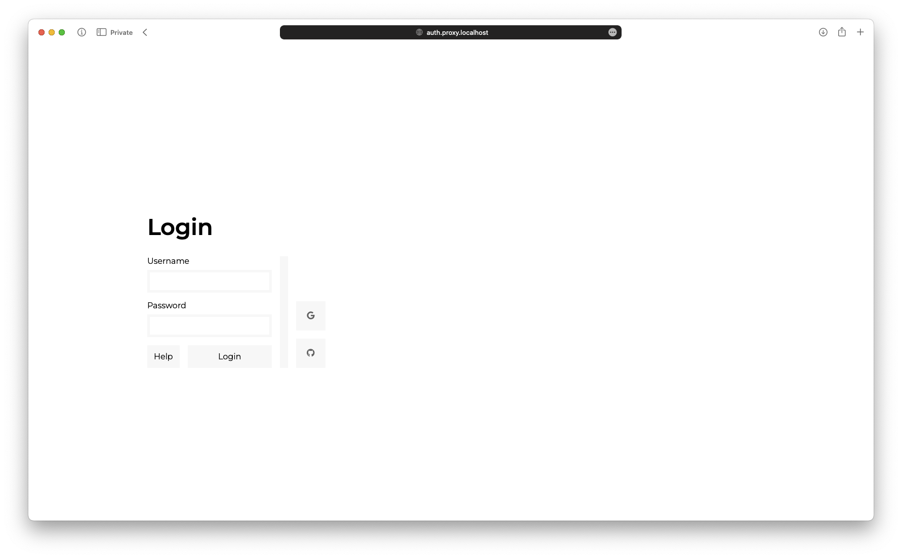
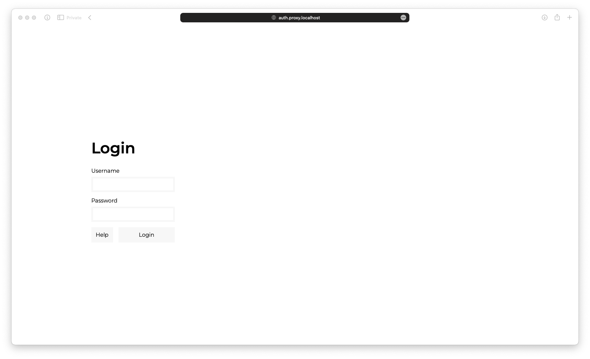
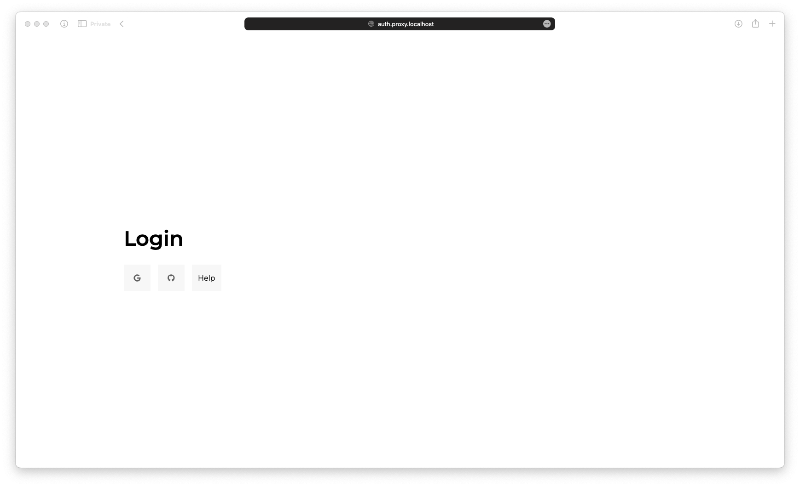

# Dockerised Authentication Proxy

[](https://github.com/PixNyb/authentication-proxy/actions/workflows/deploy.yml)

This is a Dockerised authentication for use cases where basic authentication doesn't cut it.
It integrates with the traefik reverse proxy as forward authentication middleware.

## Usage

### Build the Docker image

```bash
docker build -t authentication-proxy .
```

### Run the Docker container

```bash
docker run -d -p 8080:3000 \
    -e AUTH_HOST=localhost:8080 \
    -e COOKIE_SECURE=false \
    -e COOKIE_HOSTS=localhost:8080 \
    -e COOKIE_HOSTS_USE_ROOT=true \
    -e LOCAL_HTPASSWD_USERS=user:password \
    -e LOCAL_HTPASSWD_USERS_FILE=/etc/nginx/.htpasswd \
    -e LOCAL_HTPASSWD_DISPLAY_NAME=Local \
    -e OAUTH2_GITHUB_AUTH_URL=https://github.com/login/oauth/authorize \
    -e OAUTH2_GITHUB_TOKEN_URL=https://github.com/login/oauth/access_token \
    -e OAUTH2_GITHUB_USER_URL=https://api.github.com/user \
    -e OAUTH2_GITHUB_CLIENT_ID=xxx \
    -e OAUTH2_GITHUB_CLIENT_SECRET=xxx \
    -e OAUTH2_GITHUB_DOMAIN_WHITELIST=xxx \
    -e OAUTH2_GITHUB_ICON=fab fa-github
```

On first glance, this looks like a mess. Let's break it down:

- `-d` runs the container in detached mode
- `-p 8080:3000` maps port 8080 on the host to port 3000 in the container
- `-e AUTH_HOST=localhost:8080` is the host and port of the authentication proxy, this is used to redirect users when authentication is required.
- `-e COOKIE_SECURE=false` sets the secure flag on the cookie to false, this is useful when running the container locally, will default to true if not set.
- `-e COOKIE_HOSTS=localhost:8080` is a list of hosts that the authentication proxy is available on, this is used to be able to set cookies on multiple domains (e.g. `domain1.dev,domain2.me`)
- `-e COOKIE_HOSTS_USE_ROOT=true` sets the cookie path on the base domain, useful when all subdomains should be authenticated.

The rest of the environment variables are used to configure the authentication methods.

### Environment variables

As mentioned above, there are a few environment variables that can be used to configure the authentication proxy, these are:

| Variable              | Description                                                                                           | Default          |
| --------------------- | ----------------------------------------------------------------------------------------------------- | ---------------- |
| AUTH_PREFIX           | The prefix for the authentication proxy                                                               |                  |
| AUTH_HOST             | The host and port of the authentication proxy, used to redirect users when authentication is required | `localhost`      |
| SESSION_SECRET        | The secret used to sign the session cookie                                                            |                  |
| ACCESS_TOKEN_NAME     | The name of the access token cookie                                                                   | `_access_token`  |
| ACCESS_TOKEN_SECRET   | The secret used to sign the access token cookie                                                       | `secret`         |
| REFRESH_TOKEN_NAME    | The name of the refresh token cookie                                                                  | `_refresh_token` |
| REFRESH_TOKEN_SECRET  | The secret used to sign the refresh token cookie                                                      | `refresh`        |
| COOKIE_SECURE         | Whether the cookies should be secure or not                                                           | `true`           |
| COOKIE_HOSTS          | A list of hosts that the authentication proxy is available on                                         | `localhost`      |
| COOKIE_HOSTS_USE_ROOT | Whether the base domain should be used as the cookie domain                                           | `false`          |
| FORM_TITLE            | The title of the login form                                                                           | `Login`          |
| FORM_ADMIN_EMAIL      | The email address of the administrator, this will be shown in the help dialog                         |                  |
| FORM_DISABLE_CREDITS  | Whether the credits should be disabled or not                                                         | `false`          |
| PROMETHEUS_PREFIX     | The prefix for the Prometheus metrics endpoint. Since this route is not secured, it should be random  |                  |

> [!WARNING]
> The Prometheus metrics endpoint will always end in `/metrics`. The prefix is used to obfuscate the endpoint. (e.g. `/random-token` -> `/random-token/metrics`)

The proxy login form will change based on the authentication methods that are configured. The form will show a list of buttons for each configured provider, as well as a username and password field for the local provider.

| Both providers configured                                     | Only local provider configured                                         | Only external providers configured                                         |
| ------------------------------------------------------------- | ---------------------------------------------------------------------- | -------------------------------------------------------------------------- |
|  |  |  |

### Provider configuration

The authentication proxy supports multiple kinds of providers with support for multiple instances of each one. For all provider configuration variables the following scheme is used:
`<TYPE>_<IDENTIFIER>_<FIELD>` where `<TYPE>` is the provider type, `<IDENTIFIER>` is the instance identifier and `<FIELD>` is the field name.

> [!NOTE]
> From here on out, the provider configuration variables will be referred to as `_<FIELD>`. For example, `OAUTH2_GITHUB_AUTH_URL` will be referred to as `_AUTH_URL`.

The following variables are supported for each provider:

| Variable           | Description                                                                           | Default |
| ------------------ | ------------------------------------------------------------------------------------- | ------- |
| \_DISPLAY_NAME     | The name of the provider, this will be shown on the login form and in the help dialog |         |
| \_ICON             | The fontawesome icon to use for the provider (e.g. `fab fa-github`)                   |         |
| \_DOMAIN_WHITELIST | A list of domains that are allowed to authenticate using this provider                |         |
| \_USER_WHITELIST   | A list of users that are allowed to authenticate using this provider                  |         |

> [!NOTE]
> Although technically supported, the `LOCAL` provider does not show an icon on the login form or use the whitelists, since the user list is in itself a whitelist.

#### LOCAL

The local provider is used to authenticate users using a username and password.

Passwords should be encrypted as md5 hashes, just like in the `.htpasswd` file.

| Variable     | Description                                                            | Default |
| ------------ | ---------------------------------------------------------------------- | ------- |
| \_USERS      | A list of users in the format `username:password` separated by a comma |         |
| \_USERS_FILE | The path to the users file                                             |         |

#### OAUTH2

The OAuth2 provider is used to authenticate users using an OAuth2 provider.

| Variable        | Description                                                                                              | Default |
| --------------- | -------------------------------------------------------------------------------------------------------- | ------- |
| \_AUTH_URL      | The URL to the OAuth2 provider's authentication endpoint                                                 |         |
| \_TOKEN_URL     | The URL to the OAuth2 provider's token endpoint                                                          |         |
| \_USER_URL      | The URL to the OAuth2 provider's user endpoint                                                           |         |
| \_USER_FIELD    | The field in the user object that should be used as the identifier, this is used to check the whitelists | `email` |
| \_CLIENT_ID     | The client ID for the OAuth2 provider                                                                    |         |
| \_CLIENT_SECRET | The client secret for the OAuth2 provider                                                                |         |

#### GOOGLE

The Google provider is used to authenticate users using Google.

| Variable        | Description                               | Default |
| --------------- | ----------------------------------------- | ------- |
| \_CLIENT_ID     | The client ID for the Google provider     |         |
| \_CLIENT_SECRET | The client secret for the Google provider |         |

#### OIDC

The OIDC provider is used to authenticate users using OpenID Connect.

| Variable        | Description                                            | Default |
| --------------- | ------------------------------------------------------ | ------- |
| \_ISSUER        | The issuer URL for the OIDC provider                   |         |
| \_AUTH_URL      | The URL to the OIDC provider's authentication endpoint |         |
| \_TOKEN_URL     | The URL to the OIDC provider's token endpoint          |         |
| \_USER_URL      | The URL to the OIDC provider's user endpoint           |         |
| \_CLIENT_ID     | The client ID for the OIDC provider                    |         |
| \_CLIENT_SECRET | The client secret for the OIDC provider                |         |

## Contributing

Contributions are welcome, please read the [CONTRIBUTING.md](CONTRIBUTING.md) file for more information.